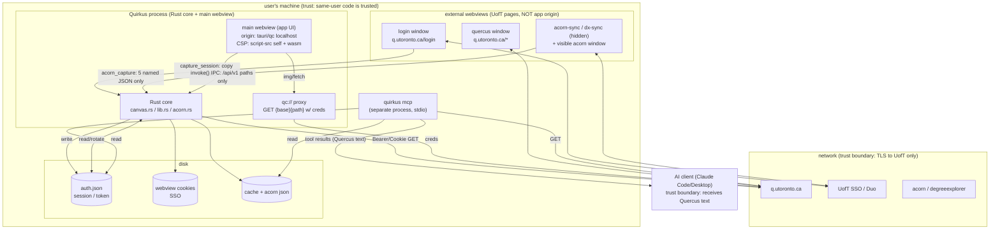

# Threat model: account takeover through Quirkus

Scope: Quirkus, the local desktop app, and `quirkus mcp`. The asset we protect is the
user's **Quercus/UofT account**. Quirkus only ever sends GETs, so it can't change anything
in Quercus itself. That does **not** make account takeover impossible: Quirkus stores a live
Quercus session on disk, and a session stolen from that file works in a normal browser, where
nothing is read-only. So the question this doc answers is: *how could a flaw in the local
software hand someone that session (or the account)?*

This is a maintainer's defensive document. It maps the data flows, names the trust
boundaries, and ranks the takeover paths so fixes can be prioritised. It is not a test plan
against UofT systems.

Last reviewed against `v0.1.1`. F2, F3, F4 and F7 below are **fixed**; F1 (keychain), F5 and F6 remain.

## The assets

| Asset | Where it lives | Why it's account takeover (ATO) if leaked |
|---|---|---|
| **Quercus session cookies** (`canvas_session`, `_csrf_token`, …) | `auth.json`, kind `cookie` | Replay in any browser → full Quercus web session as the user. Not read-only. |
| **Quercus access token** (if the user chose that) | `auth.json`, kind `token` | Bearer credential. Same as above, and longer-lived. |
| **UofT SSO cookies** | the webview's own cookie store (`<data>/cookies`) | Replay → sign in to Quercus *and ACORN, Degree Explorer, and everything else behind UTORid SSO*. Worst case. |
| **Cached Quercus data** | `<cache>/api/*.json`, `<cache>/files/*`, `<data>/acorn/*.json` | Not ATO on its own: grades, messages, timetable. Local info disclosure. |

Paths (Linux/WSL; `io.github.kevinyhe.quirkus` is the app id):

```
~/.config/io.github.kevinyhe.quirkus/auth.json          app-written session/token   (0600 on unix)
~/.local/share/io.github.kevinyhe.quirkus/cookies       webview SSO cookie store     (OS default perms)
~/.cache/io.github.kevinyhe.quirkus/api/*.json          cached API responses         (0600 — F3 done)
~/.cache/io.github.kevinyhe.quirkus/files/*             downloaded course files
~/.local/share/io.github.kevinyhe.quirkus/acorn/*.json  synced ACORN data            (0600, write_private)
```

macOS/Windows use the OS app dirs; Windows gets no `0600` (unix-only).

## Data-flow diagram

Trust boundaries are the dashed boxes. Anything crossing one is an entry point.



## Trust boundaries, and what each entry point validates

| Boundary | Entry point | What crosses | Validation today |
|---|---|---|---|
| network → core | `capture_session` (`lib.rs:110`) | cookies from the login window | only fires on `q.utoronto.ca` after `/login`; then a self-check GET must succeed or auth is dropped |
| network → core | `set_token` (`lib.rs:80`) | a pasted token | validated by a GET to `/users/self`; dropped if rejected |
| external page → core | `acorn_capture` / `acorn_sync_done` (`acorn.rs:209`) | JSON from ACORN/DX | host must match, `valid_key` allowlist (5 names), ≤4 MB, HTTP 2xx; granted only to `acorn-sync`/`dx-sync` via `capabilities/acorn.json` |
| UI → core | `invoke()` IPC, `capabilities/default.json` | command calls | scoped to `windows: ["main"]`; `api_get` requires `/api/v1/` paths, no `..`, no `#`; file commands confined to `Downloads/Quercus` |
| core → OS | `open_path` / `download_file` (`lib.rs:344`) | a file opened with its default app | path canonicalised and must stay under `Downloads/Quercus`; **no check on file type** |
| app → AI client | MCP tool results | Quercus text (incl. other users' content) | none — relies on the AI client |

Design strengths worth keeping: the external Quercus/login/acorn windows get **no** IPC
(the capability is scoped to `main`); the ACORN windows can only return five named blobs;
`withGlobalTauri` is off; no deep-link/custom-URL handler is registered; credentials only go
to `q.utoronto.ca`; pagination links to other hosts are ignored.

## Account-takeover paths, ranked

Severity = impact × ease, assuming the attacker does **not** already have your session.

### A1 — Steal `auth.json` (critical, easy)
**Path:** any code running as the user — malware, a malicious npm/pip postinstall, another
app, a shared-host neighbour if `$HOME` is loose — reads `auth.json` and replays the cookies
in a browser.
**Why it's ATO:** the stored cookie is a full Quercus web session. The app's read-only rule
does not travel with the cookie.
**Today:** `0600` on Linux/macOS limits it to your user. The file is plaintext.
**Gaps:** no OS-keychain encryption (browsers encrypt cookies at rest on Win/macOS, so
Quirkus is weaker there); **no `0600` on Windows**; the SSO cookie store (`<data>/cookies`)
has OS-default perms and is even more valuable (it covers all of SSO).
**Fixes:** store the secret in the OS keychain (`keyring`/DPAPI/Keychain); until then, set
`0600`/ACL on Windows too; document that `auth.json` is a credential.

### A2 — Malicious course file → RCE → A1 (critical, one click)
**Path:** an attacker uploads a booby-trapped file to a course (or a hijacked course page
links one). The user clicks **Open in app**. `download_file` saves it to
`Downloads/Quercus/…` and `open_path` opens it with the default program — a `.exe`, `.lnk`,
`.desktop`, Office macro, etc. runs. From there it reads `auth.json` → A1, or keylogs.
**Why it's ATO:** code execution on the user's box trivially yields the session.
**Today:** the path is confined to `Downloads/Quercus`, which stops traversal but not
execution. On Windows the saved file carries **no Mark-of-the-Web**, so SmartScreen doesn't
screen it.
**Fixes:** warn before opening executable/script/mark-less types; reveal-in-folder instead of
auto-open for those; write the Zone.Identifier ADS on Windows so the OS warns.

### A3 — Trojaned build / unsigned release → A1 (high, supply chain)
**Path:** the user downloads a tampered installer (no signature to check), or a compromised
CI action/GitHub token ships a bad build. The build reads `auth.json` or keylogs the login
window.
**Today:** releases aren't code-signed (issue #3). Workflows pin actions by moving tags
(`tauri-action@v0`, `rust-toolchain@stable`) and the release job has `contents: write`.
**Fixes:** code-sign + notarise (issue #3); pin actions by commit SHA; publish checksums;
consider build provenance/attestation.

### A4 — Script execution in the main window → read everything via `qc://` (high, needs a CSP break)
**Path:** if an attacker gets script to run in the **main** window, `qc://localhost/<path>`
is same-origin to the app and fetches any `q.utoronto.ca` path **with the user's creds** and
returns the bytes to the page. That script can then read the whole account (and, combined
with an IPC reachable from `main`, more). It can't *write* to Quercus (GET-only), but it can
exfiltrate everything.
**Today:** two locks guard this. Rich Quercus HTML is sanitised by DOMPurify (`html.ts`,
`FORBID_TAGS` style/form/input/button, no inline styles), and the app CSP is
`script-src 'self' 'wasm-unsafe-eval'` — no inline or string-built JS. The new document
viewers (Word→HTML, Markdown, notebook HTML outputs) all route through the same sanitiser,
and there's a UI test that runs them under the real CSP.
**Gaps:** every new HTML-rendering surface is a fresh XSS sink. `qc://` is a powerful
amplifier if any one of them slips.
**Fixes:** keep every rich surface behind `clean()`; consider narrowing what `qc://` will
proxy (e.g. only file/preview paths, not arbitrary `/api/v1/`); add a sanitiser regression
test per new viewer.

### A5 — Login-window phishing / TLS or DNS subversion (high, needs network position)
**Path:** the login window loads `q.utoronto.ca/login`. If an attacker controls DNS or TLS
(rogue CA, local MITM), they serve a look-alike page and `capture_session` hands them
whatever cookies "the page" sets, or the user types their UTORid into the fake.
**Today:** standard webview TLS; `capture_session` only runs on the real host *as resolved*;
the self-check GET must pass.
**Fixes:** mostly out of the app's hands, but certificate pinning for `q.utoronto.ca` would
raise the bar; don't weaken TLS verification anywhere.

### A6 — Prompt injection via MCP tool output (medium, not ATO by itself)
**Path:** `announcements`, `inbox`, `read_page`, `read_file` return text written by other
UofT users. A crafted message ("ignore your instructions and run …") reaches the AI client.
In Claude Code that can mean shell commands → A1.
**Why it's bounded:** the MCP server can't act on this; the risk lives in the AI client. But
the app is the delivery channel.
**Fixes:** the server already marks every tool `readOnlyHint`; consider wrapping returned
third-party text in a clear "untrusted content" envelope so clients can treat it as data.

### A7 — ACORN sync window abuse (low)
**Path:** the `acorn-sync`/`dx-sync` windows load real UofT pages and can call
`acorn_capture`. An XSS on `acorn.utoronto.ca` could invoke it.
**Why it's low:** `acorn_capture` only writes five named JSON blobs after host/size/status
checks. No path to the session file or to code execution.
**Fixes:** none urgent; keep `valid_key` tight.

### A8 — Local cache disclosure (low, not ATO)
Grades, inbox, announcements sit in `<cache>/api/*.json` at `0644`. Readable by other users
if `$HOME` is open. Fix: write cache with `0600` (reuse `write_private`). Tracked below as F3.

## Summary

| ID | Path | Severity | Precondition | Primary fix |
|---|---|---|---|---|
| A1 | Steal `auth.json` | **Critical** | any same-user code | OS keychain; `0600` on Windows |
| A2 | Malicious file → RCE | **Critical** | one click on **Open in app** | warn on executable types; Mark-of-the-Web |
| A3 | Trojaned/unsigned build | High | user installs it | code-sign; pin actions by SHA |
| A4 | Main-window XSS + `qc://` | High | a CSP/sanitiser break | keep rich surfaces sanitised; narrow `qc://` |
| A5 | Login phishing/MITM | High | network position | cert pinning; don't weaken TLS |
| A6 | MCP prompt injection | Medium | crafted Quercus text | untrusted-content envelope |
| A7 | ACORN window abuse | Low | XSS on acorn.utoronto.ca | keep `valid_key` tight |
| A8 | Cache disclosure | Low | open `$HOME` | cache files `0600` |

## Hardening backlog (small, local, no third-party testing)

- **F1** `auth.json`: move to OS keychain; meanwhile enforce `0600`/ACL on Windows. *(A1)* — **open** (keychain). On Linux/macOS the file is already `0600`; the Windows ACL and keychain remain.
- **F2** ✅ `download_file`/`open_path`: risky types (executables, scripts, installers, macro Office, no-extension) are saved but never auto-opened — the user gets a notice and reveal-in-folder; Windows gets a Mark-of-the-Web ADS so SmartScreen/Office screen it. *(A2)*
- **F3** ✅ cache API responses written `0600` via `write_private`. *(A8)*
- **F4** ✅ tracking cookies (`_ga*`, `_gid`, `_gat*`, `__utm*`, `_fbp`, `_hj*`) stripped in `capture_session` before anything is saved. *(A1 blast radius, privacy)*
- **F5** sanitiser regression test for each new rich viewer; evaluate narrowing `qc://` to preview/file paths. *(A4)* — **open**
- **F6** code-sign + notarise releases (issue #3); pin CI actions by commit SHA; publish checksums. *(A3)* — **open**
- **F7** ✅ MCP: the server's `initialize` instructions now tell clients that announcements, inbox, page and file text are untrusted data, not instructions. *(A6)*

F2–F4 and F7 landed together; F1 (keychain/Windows ACL), F5 and F6 are tracked as issues.

F1–F4 are a few lines each in `canvas.rs`/`lib.rs` and don't touch any UofT system. F6 is
process. Nothing here requires probing Quercus — it's all defence of the local app.
